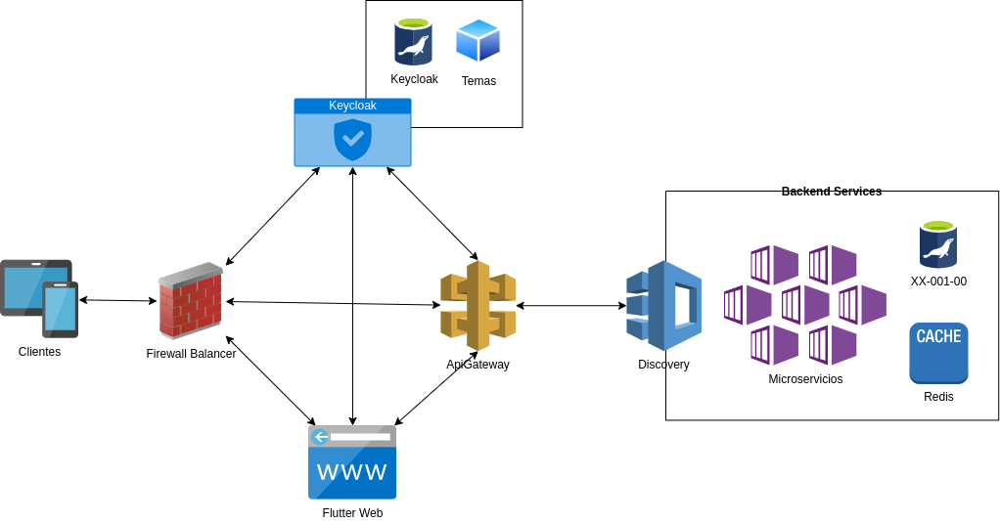

#Arquitectura de la aplicación

La arquitectura del aplicativo esta diseñada para ser escalable y modular, de tal forma que se puedan agregar nuevos módulos sin afectar el funcionamiento de los ya existentes. 

**Firewall:** Es el encargado de proteger la aplicación de accesos no autorizados, bloqueando los puertos que no se utilizan y permitiendo el acceso solo a los puertos que se utilizan.

**Keycloak:** Un servidor de seguridades que permite la autenticación y autorización de los usuarios, a la vez que permite la administración de los usuarios y roles. Y que se integra con el aplicativo mediante el protocolo OpenID Connect.
- *Tema:* Se utiliza un tema personalizado para la interfaz de usuario de Keycloak, de tal forma que se integre con la interfaz de usuario del aplicativo.
- *Base de datos:* Se utiliza una base de datos externa para almacenar los usuarios y roles, de tal forma que se pueda escalar el aplicativo sin afectar el funcionamiento de Keycloak.

**API Gateway:** Es el punto de entrada de la aplicación, es el encargado de recibir las peticiones de los clientes y redirigirlas a los microservicios correspondientes. También es el encargado de la seguridad de la aplicación, ya que valida los tokens de acceso de los usuarios y los roles que tienen asignados.

**Discovery Service:** Es el encargado de registrar los microservicios y de mantener actualizada la lista de microservicios disponibles. El API Gateway consulta al Discovery Service para saber a que microservicio debe redirigir la petición.

**Microservicios:** Son los encargados de realizar las operaciones de negocio de la aplicación, y se comunican con la base de datos para obtener y almacenar la información. Estos microservicios se comunican entre si para realizar operaciones complejas.
- *Base de datos:* Se utiliza una base de datos externa para almacenar la información de la aplicación, de tal forma que se pueda escalar el aplicativo sin afectar el funcionamiento de los microservicios.
- *Cache/Redis:* Se utiliza una cache para almacenar la información que se utiliza con frecuencia, de tal forma que se reduzca el tiempo de respuesta de los microservicios.

---

<omargo33@gmail.com>

**Create on 2019-10-01**